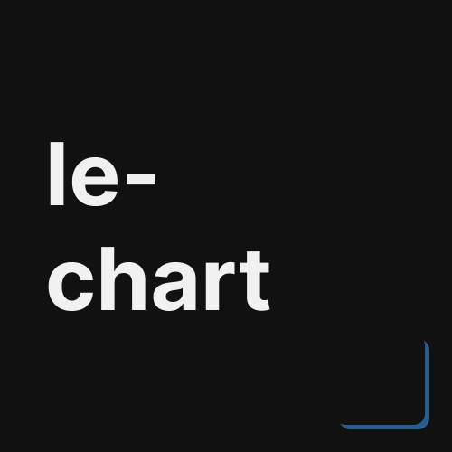

<div align="center">
  
  
  <h3><b>leChart</b></h3>
</div>

# 📗 Table of Contents
- [📖 About the Project](#about-project)
  - [⚙️ Production (done)](#production)
    - [Tech Stack](#tech-stack)
    - [Key Features](#key-features)
  - [🚀 Live Demo](#live-demo)
- [💻 Getting Started](#getting-started)
  - [Prerequisites](#prerequisites)
  - [Installation](#installation)
  - [Usage](#usage)
- [🤝 Contributing](#contributing)
- [📝 License](#license)

<br>


# 📖 leChart <a name="about-project"></a>
**leChart** is a simple application developed using Python, integrated with the Streamlit package to display and analyze CSV file data, specifically related to DDOS Attack. The application also uses pyecharts to generate visually appealing charts, making the data more engaging and easier to understand. 

- **This project is part of a university assignment.**

## ⚙️ Production (done)<a name="production"></a>
This project progressed over the **course of one weeks** before its public release, following several key stages: starts with finding the core idea, implementing it using Python language, and refining the functionality to meet the project requirements.

### Tech Stack <a name="tech-stack"></a>
- Basic Python knowledge.
- Streamlit packages.
- Pyecharts packages.

### Key Features <a name="key-features"></a>
- **CSV Data Visualization**: Displays cybercrime-related data from CSV files.
- **Interactive Web Interface**: Built with Streamlit, user-friendly interface for exploring the data.
- **Dynamic Chart**: Utilizes Pyecharts to create visually engaging charts that make complex data easier to understand.
<p align="right">(<a href="#readme-top">back to top</a>)</p>


## 🚀 Live Demo <a name="live-demo"></a>
Sadly, this project is **not available** on any website. But you can make it live using **Streamlit live website**, or create local copy on your own.
<p align="right">(<a href="#readme-top">back to top</a>)</p>


## 💻 Getting Started <a name="getting-started"></a>
To get a local copy up and running, follow these steps.

### Prerequisites
- Clone this project at your directory.
```sh
git clone https://github.com/d1azdn/lechart
```

### Install
- You should install streamlit and pyecharts first.
```sh
pip3 install streamlit
pip3 install pyecharts
```

### Usage
- Make sure you have the csv file (univ file.)
- To run the project, run the following commands:
```sh
streamlit run main.py
```
<p align="right">(<a href="#readme-top">back to top</a>)</p>


## 🤝 Contributing <a name="contributing"></a>
Contributions, issues, and feature requests are welcome!
Feel free to check the [issues page](../../issues/).
<p align="right">(<a href="#readme-top">back to top</a>)</p>


## 📝 License <a name="license"></a>
This project is [MIT](./LICENSE) licensed.

_NOTE: we recommend using the [MIT license](https://choosealicense.com/licenses/mit/) - you can set it up quickly by [using templates available on GitHub](https://docs.github.com/en/communities/setting-up-your-project-for-healthy-contributions/adding-a-license-to-a-repository). You can also use [any other license](https://choosealicense.com/licenses/) if you wish._

<p align="right">(<a href="#readme-top">back to top</a>)</p>
